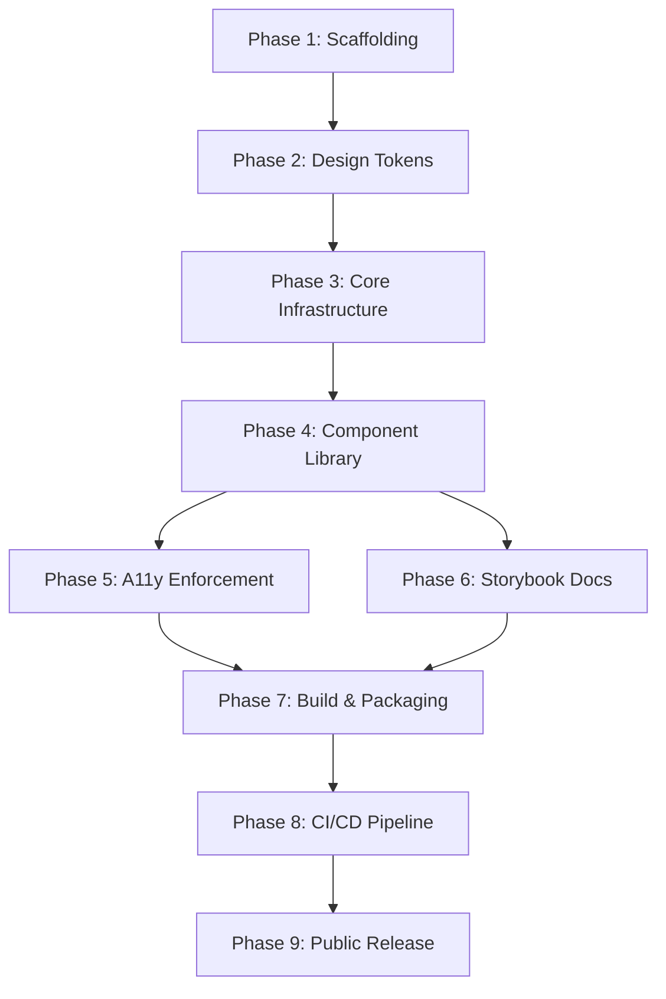

# OrbitUI — Full Implementation Plan

## Goal

Build **OrbitUI**, a production-grade enterprise design system and React (JS/JSX) component library. The project demonstrates senior-to-staff level frontend expertise through token-driven theming, accessibility-first architecture, compound/polymorphic component patterns, and professional NPM distribution — all without TypeScript.

---

## Tech Stack Summary

| Layer | Tool | Why |
|---|---|---|
| UI Framework | React 19 (JS/JSX) | Core rendering, hooks-based API |
| Build | Vite (library mode) | Fast HMR, ESM/CJS dual output |
| Styling | Tailwind CSS v4 | Utility-first, token-driven, themeable |
| Accessibility | React Aria (Adobe) | Headless a11y hooks & primitives |
| Tokens | Style Dictionary | Multi-platform token transforms |
| Docs | Storybook 8 | Interactive component playground |
| Testing | Vitest + Axe-core + Testing Library | Unit + a11y + interaction tests |
| Linting | ESLint + Prettier | Code quality |
| CI/CD | GitHub Actions | Automated release pipeline |
| Publishing | NPM (`@orbitui/react`) | Public package registry |

---

## Project Structure (Target)

```
orbitui/
├── .github/
│   └── workflows/
│       ├── ci.yml                    # Lint, test, build, a11y, bundle-size
│       └── release.yml               # Automated NPM publish
├── .storybook/
│   ├── main.js
│   ├── preview.js
│   └── manager.js
├── tokens/
│   ├── base/
│   │   ├── colors.json
│   │   ├── spacing.json
│   │   ├── typography.json
│   │   ├── radii.json
│   │   └── shadows.json
│   ├── themes/
│   │   ├── default.json
│   │   └── dark.json
│   └── brands/
│       ├── brand-a.json
│       └── brand-b.json
├── style-dictionary/
│   └── config.js                     # Transform & format config
├── src/
│   ├── index.js                      # Public barrel export
│   ├── tokens/
│   │   └── generated/                # Auto-generated CSS vars & JS tokens
│   ├── hooks/
│   │   ├── useControllableState.js
│   │   ├── useId.js
│   │   └── useMediaQuery.js
│   ├── utils/
│   │   ├── polymorphic.js            # createPolymorphicComponent helper
│   │   ├── composeRefs.js
│   │   ├── cn.js                     # clsx + twMerge utility
│   │   └── createContext.js          # Compound component context factory
│   ├── components/
│   │   ├── Button/
│   │   │   ├── Button.jsx
│   │   │   ├── Button.stories.jsx
│   │   │   ├── Button.test.jsx
│   │   │   └── index.js
│   │   ├── Input/
│   │   ├── Textarea/
│   │   ├── Checkbox/
│   │   ├── RadioGroup/
│   │   ├── Select/
│   │   ├── Modal/
│   │   ├── Dropdown/
│   │   ├── Combobox/
│   │   ├── DataTable/
│   │   ├── Tabs/
│   │   ├── Tooltip/
│   │   ├── Toast/
│   │   ├── CommandPalette/
│   │   ├── Breadcrumbs/
│   │   └── Pagination/
│   └── providers/
│       └── OrbitProvider.jsx          # Theme + config context provider
├── tailwind.config.js
├── vite.config.js
├── vitest.config.js
├── package.json
├── README.md
├── CHANGELOG.md
└── LICENSE
```

---

## Phase 1 — Project Scaffolding & Toolchain

> **Goal**: Initialize the repo with Vite, React, Tailwind, linting, and testing — a fully working dev environment before any components exist.

### Tasks

#### [NEW] `package.json`
- Initialize with `npm init`
- Set `name: "@orbitui/react"`, `type: "module"`
- Define `main` (CJS), `module` (ESM), `exports` map, `files`, `sideEffects: false`
- Install core deps:
  - `react`, `react-dom` (peer deps)
  - `react-aria`, `react-stately` (accessibility)
  - `tailwindcss`, `@tailwindcss/vite` (styling)
  - `clsx`, `tailwind-merge` (class utilities)

#### [NEW] `vite.config.js`
- Configure **library mode** with `build.lib` entry pointing to `src/index.js`
- Set `rollupOptions.external` for `react`, `react-dom`, `react-aria`
- Output formats: `es` and `cjs`
- Enable CSS extraction
- Configure path aliases (`@/` → `src/`)

#### [NEW] `tailwind.config.js`
- Extend with OrbitUI design token values (colors, spacing, typography, radii, shadows)
- Configure `content` paths for `src/**/*.{js,jsx}`
- Set up theme extension mapped to CSS custom properties from tokens

#### [NEW] `.eslintrc.cjs` + `.prettierrc`
- ESLint with `eslint-plugin-react`, `eslint-plugin-jsx-a11y`, `eslint-plugin-react-hooks`
- Prettier with consistent formatting rules

#### [NEW] `vitest.config.js`
- Configure jsdom environment
- Setup files for Testing Library and axe-core integration
- Coverage thresholds: 80% statements, 80% branches

---

## Phase 2 — Design Token Architecture

> **Goal**: Define all visual properties as structured tokens, transform them with Style Dictionary into CSS custom properties and JS modules, and wire them into Tailwind.

### Tasks

#### [NEW] `tokens/base/colors.json`
```json
{
  "color": {
    "primary": { "50": { "value": "#EEF2FF" }, "500": { "value": "#6366F1" }, "900": { "value": "#312E81" } },
    "neutral": { "0": { "value": "#FFFFFF" }, "50": { "value": "#F9FAFB" }, "900": { "value": "#111827" } },
    "success": { "500": { "value": "#22C55E" } },
    "warning": { "500": { "value": "#F59E0B" } },
    "danger":  { "500": { "value": "#EF4444" } }
  }
}
```
- Full scales for primary, neutral, success, warning, danger, info

#### [NEW] `tokens/base/spacing.json`, `typography.json`, `radii.json`, `shadows.json`
- Spacing: 4px base unit scale (0, 1, 2, 3, 4, 5, 6, 8, 10, 12, 16, 20, 24)
- Typography: font families (sans, mono), sizes (xs–4xl), weights, line heights
- Radii: none, sm, md, lg, xl, full
- Shadows: sm, md, lg, xl

#### [NEW] `tokens/themes/default.json` + `dark.json`
- Semantic aliases mapping to base tokens:
  - `color-background-primary` → `color.neutral.0` (light) / `color.neutral.900` (dark)
  - `color-text-primary` → `color.neutral.900` (light) / `color.neutral.50` (dark)
  - `color-border-default` → `color.neutral.200` / `color.neutral.700`
  - etc.

#### [NEW] `tokens/brands/brand-a.json` + `brand-b.json`
- Override primary color scales per brand
- Override typography (font family) per brand

#### [NEW] `style-dictionary/config.js`
- Source: `tokens/**/*.json`
- Platforms:
  - **CSS**: output `src/tokens/generated/variables.css` (CSS custom properties)
  - **JS/ESM**: output `src/tokens/generated/tokens.js` (JS object export)
- Custom transforms for Tailwind-compatible naming
- Build script in `package.json`: `"tokens:build": "style-dictionary build --config style-dictionary/config.js"`

#### [MODIFY] `tailwind.config.js`
- Map all Tailwind theme values to CSS custom properties from generated tokens:
  ```js
  colors: {
    primary: {
      50: 'var(--color-primary-50)',
      500: 'var(--color-primary-500)',
      // ...
    }
  }
  ```

---

## Phase 3 — Core Infrastructure & Patterns

> **Goal**: Build the foundational utilities, hooks, and patterns that every component will depend on.

### Tasks

#### [NEW] `src/utils/polymorphic.js`
- `createPolymorphicComponent(defaultTag, render)` factory
- Accepts `as` prop, forwards refs, merges props
- JSDoc annotations for IntelliSense

#### [NEW] `src/utils/createContext.js`
- `createSafeContext(name)` factory for compound components
- Returns `[Provider, useContext]` tuple
- Throws descriptive error if `useContext` is used outside Provider

#### [NEW] `src/utils/cn.js`
- Combines `clsx` + `tailwind-merge` for conflict-free class composition
- Single exported `cn(...inputs)` function

#### [NEW] `src/utils/composeRefs.js`
- Utility to merge multiple refs (callback + object refs)
- Used when component needs internal ref + forwarded ref

#### [NEW] `src/hooks/useControllableState.js`
- Supports both controlled (`value` + `onChange`) and uncontrolled (`defaultValue`) modes
- Used by every form component
- Well-documented JSDoc with usage examples

#### [NEW] `src/hooks/useId.js`
- Generates stable unique IDs for a11y attributes
- Falls back to `React.useId()` in React 18+

#### [NEW] `src/hooks/useMediaQuery.js`
- SSR-safe media query hook
- Used for responsive behavior in components

#### [NEW] `src/providers/OrbitProvider.jsx`
- Wraps app with theme context
- Accepts `theme` prop (`"light"` | `"dark"` | custom object)
- Accepts `brand` prop for multi-brand switching
- Injects CSS custom properties at root level
- Provides context consumed by components for theme-aware behavior

---

## Phase 4 — Component Library (Core Build)

> **Goal**: Build all 15 components in dependency order. Each component gets its own folder with implementation, stories, tests, and barrel export.

### Component Build Order & Specifications

Components are ordered by dependency — foundational primitives first, complex composites last.

---

### 4.1 — Button

| Aspect | Detail |
|---|---|
| File | `src/components/Button/Button.jsx` |
| Pattern | Polymorphic (`as` prop), forwardRef |
| React Aria | `useButton` hook |
| Variants | `primary`, `secondary`, `outline`, `ghost`, `danger` |
| Sizes | `sm`, `md`, `lg` |
| States | loading (spinner + aria-busy), disabled, focus-visible |
| Props | `variant`, `size`, `isLoading`, `leftIcon`, `rightIcon`, `as`, `children` |
| A11y | Keyboard enter/space, focus ring, disabled via `aria-disabled` |

---

### 4.2 — Input

| Aspect | Detail |
|---|---|
| File | `src/components/Input/Input.jsx` |
| Pattern | forwardRef, controlled/uncontrolled |
| React Aria | `useTextField` hook |
| Features | Label, helper text, error message, left/right addons |
| Validation | `isInvalid`, `errorMessage`, `isRequired` |
| A11y | `aria-describedby` linking label → input → error |

---

### 4.3 — Textarea

| Aspect | Detail |
|---|---|
| File | `src/components/Textarea/Textarea.jsx` |
| Pattern | forwardRef, controlled/uncontrolled |
| React Aria | `useTextField` with `inputElementType="textarea"` |
| Features | Auto-resize option, character count, max length |

---

### 4.4 — Checkbox

| Aspect | Detail |
|---|---|
| File | `src/components/Checkbox/Checkbox.jsx` |
| React Aria | `useCheckbox` + `useToggleState` |
| Features | Indeterminate state, custom icons, label positioning |
| A11y | Proper `role="checkbox"`, `aria-checked` states |

---

### 4.5 — RadioGroup

| Aspect | Detail |
|---|---|
| File | `src/components/RadioGroup/RadioGroup.jsx` |
| Pattern | Compound (`RadioGroup` + `RadioGroup.Item`) |
| React Aria | `useRadioGroup` + `useRadio` |
| Features | Horizontal/vertical orientation, descriptions per item |

---

### 4.6 — Select

| Aspect | Detail |
|---|---|
| File | `src/components/Select/Select.jsx` |
| Pattern | Compound + controlled/uncontrolled |
| React Aria | `useSelect` + `useListBox` |
| Features | Searchable, multi-select option, grouped options |
| A11y | `listbox` role, `aria-activedescendant`, keyboard arrow nav |

---

### 4.7 — Tooltip

| Aspect | Detail |
|---|---|
| File | `src/components/Tooltip/Tooltip.jsx` |
| React Aria | `useTooltipTrigger` + `useTooltip` |
| Features | Configurable placement (top/right/bottom/left), delay, arrow |
| A11y | `role="tooltip"`, `aria-describedby` |

---

### 4.8 — Modal / Dialog

| Aspect | Detail |
|---|---|
| File | `src/components/Modal/Modal.jsx` |
| Pattern | Compound (`Modal`, `Modal.Header`, `Modal.Body`, `Modal.Footer`) |
| React Aria | `useDialog` + `useOverlay` + `useModal` + `FocusScope` |
| Features | Sizes (sm/md/lg/full), overlay dismiss, scroll lock, animations |
| A11y | Focus trap, Escape to close, return focus to trigger, `aria-modal` |

---

### 4.9 — Tabs

| Aspect | Detail |
|---|---|
| File | `src/components/Tabs/Tabs.jsx` |
| Pattern | Compound (`Tabs`, `Tabs.List`, `Tabs.Trigger`, `Tabs.Content`) |
| React Aria | `useTabList` + `useTab` + `useTabPanel` |
| Features | Horizontal/vertical, controlled/uncontrolled, disabled tabs |
| A11y | Arrow key navigation, `role="tablist/tab/tabpanel"`, `aria-selected` |

---

### 4.10 — Dropdown

| Aspect | Detail |
|---|---|
| File | `src/components/Dropdown/Dropdown.jsx` |
| Pattern | Compound (`Dropdown`, `Dropdown.Trigger`, `Dropdown.Menu`, `Dropdown.Item`) |
| React Aria | `useMenuTrigger` + `useMenu` + `useMenuItem` |
| Features | Sections/dividers, keyboard nav, disabled items, icons |
| A11y | `role="menu"`, `aria-haspopup`, focus management |

---

### 4.11 — Combobox

| Aspect | Detail |
|---|---|
| File | `src/components/Combobox/Combobox.jsx` |
| React Aria | `useComboBox` + `useFilter` + `useListBox` |
| Features | Type-ahead filtering, async loading, empty state, virtualized list option |
| A11y | `role="combobox"`, `aria-autocomplete`, live region announcements |

---

### 4.12 — Toast / Notification

| Aspect | Detail |
|---|---|
| File | `src/components/Toast/Toast.jsx` + `ToastProvider.jsx` |
| Pattern | Provider + imperative API (`toast.success("Saved!")`) |
| Features | Variants (success, error, warning, info), auto-dismiss, pause on hover, stacking |
| A11y | `role="status"`, `aria-live="polite"`, focus management |

---

### 4.13 — Data Table

| Aspect | Detail |
|---|---|
| File | `src/components/DataTable/DataTable.jsx` |
| React Aria | `useTable` + `useTableCell` + `useTableRow` |
| Features | Column sorting, filtering, row selection, pagination, virtualization (react-window) |
| A11y | Proper `role="grid"`, `aria-sort`, keyboard cell navigation |
| Dep | May use `@tanstack/react-virtual` for virtualization |

---

### 4.14 — Breadcrumbs

| Aspect | Detail |
|---|---|
| File | `src/components/Breadcrumbs/Breadcrumbs.jsx` |
| Pattern | Compound (`Breadcrumbs` + `Breadcrumbs.Item`) |
| React Aria | `useBreadcrumbs` + `useBreadcrumbItem` |
| Features | Custom separator, collapsed items for long paths, current page indicator |
| A11y | `nav` landmark, `aria-current="page"` on last item |

---

### 4.15 — Pagination

| Aspect | Detail |
|---|---|
| File | `src/components/Pagination/Pagination.jsx` |
| Features | Page numbers, prev/next, first/last, ellipsis, controlled/uncontrolled |
| A11y | `nav` landmark, `aria-label`, `aria-current` on active page |

---

### 4.16 — Command Palette

| Aspect | Detail |
|---|---|
| File | `src/components/CommandPalette/CommandPalette.jsx` |
| Pattern | Overlay + Combobox-like search |
| React Aria | `useDialog` + `useComboBox` + `useFilter` |
| Features | `Cmd+K` / `Ctrl+K` trigger, grouped actions, recent items, keyboard-only nav |
| A11y | Focus trap, `aria-modal`, search announcements |

---

### Per-Component Deliverables Checklist

For **every** component above:

- [ ] `Component.jsx` — Implementation with JSDoc annotations on every prop
- [ ] `index.js` — Named + default export barrel
- [ ] `Component.stories.jsx` — Storybook stories: default, all variants, interactive controls, edge cases
- [ ] `Component.test.jsx` — Unit tests: rendering, prop variations, keyboard interaction, a11y (axe-core)

---

## Phase 5 — Accessibility Enforcement

> **Goal**: Ensure WCAG 2.1 AA compliance is baked into every layer, not bolted on.

### Tasks

#### [NEW] `src/test/setup.js`
- Global axe-core matcher: `expect.extend(toHaveNoViolations)`
- Custom Testing Library render wrapper with `OrbitProvider`

#### Per-component a11y test pattern:
```js
it('has no accessibility violations', async () => {
  const { container } = render(<Button>Click me</Button>);
  const results = await axe(container);
  expect(results).toHaveNoViolations();
});
```

#### Keyboard test pattern:
```js
it('activates on Enter and Space', async () => {
  const onClick = vi.fn();
  render(<Button onClick={onClick}>Test</Button>);
  const button = screen.getByRole('button');
  await userEvent.keyboard('{Enter}');
  expect(onClick).toHaveBeenCalledTimes(1);
  await userEvent.keyboard(' ');
  expect(onClick).toHaveBeenCalledTimes(2);
});
```

#### [NEW] `.storybook/a11y-addon` integration
- Install `@storybook/addon-a11y`
- Configure in `.storybook/main.js`
- Auto-runs axe on every story panel

---

## Phase 6 — Storybook Documentation Site

> **Goal**: Build a polished, comprehensive documentation experience using Storybook 8.

### Tasks

#### [NEW] `.storybook/main.js`
- Framework: `@storybook/react-vite`
- Addons: `a11y`, `controls`, `actions`, `docs`, `viewport`, `themes`
- Story discovery: `src/**/*.stories.jsx`

#### [NEW] `.storybook/preview.js`
- Global decorators: wrap all stories in `OrbitProvider`
- Theme switcher (light/dark/brand-a/brand-b)
- Viewport presets (mobile, tablet, desktop)
- Global argTypes for common props

#### [NEW] `src/docs/` — MDX Documentation Pages
- `Introduction.mdx` — Project overview, philosophy, getting started
- `DesignTokens.mdx` — Token reference with visual swatches
- `Theming.mdx` — How to switch themes and create custom brands
- `Accessibility.mdx` — A11y principles, testing strategy, compliance status
- `Installation.mdx` — NPM install, peer deps, provider setup

#### Autodocs
- Enable `autodocs` tag globally so every component auto-generates a docs page from JSDoc

---

## Phase 7 — Build, Packaging & Bundle

> **Goal**: Produce optimized ESM + CJS bundles ready for NPM publishing.

### Tasks

#### [MODIFY] `vite.config.js` — Production Build
```js
build: {
  lib: {
    entry: resolve(__dirname, 'src/index.js'),
    name: 'OrbitUI',
    formats: ['es', 'cjs'],
    fileName: (format) => `orbitui.${format}.js`
  },
  rollupOptions: {
    external: ['react', 'react-dom', 'react-aria', 'react-stately'],
    output: {
      preserveModules: true,        // Tree-shaking support
      preserveModulesRoot: 'src',
      globals: { react: 'React', 'react-dom': 'ReactDOM' }
    }
  },
  cssCodeSplit: true,
  sourcemap: true
}
```

#### [MODIFY] `package.json` — Exports Map
```json
{
  "exports": {
    ".": {
      "import": "./dist/index.js",
      "require": "./dist/index.cjs"
    },
    "./styles.css": "./dist/styles.css"
  },
  "sideEffects": ["*.css"],
  "peerDependencies": {
    "react": ">=18.0.0",
    "react-dom": ">=18.0.0"
  }
}
```

#### [NEW] `scripts/check-bundle-size.js`
- Uses `bundlesize` or custom script with `gzip-size`
- Budget: core bundle < 30KB gzipped
- Per-component budget: < 5KB gzipped each
- Fails CI if budget exceeded

#### [NEW] `src/index.js` — Public API Barrel
```js
// Components
export { Button } from './components/Button';
export { Input } from './components/Input';
// ... all components

// Provider
export { OrbitProvider } from './providers/OrbitProvider';

// Hooks (public)
export { useControllableState } from './hooks/useControllableState';
```

---

## Phase 8 — CI/CD Pipeline

> **Goal**: Automate quality gates and release flow via GitHub Actions.

### Tasks

#### [NEW] `.github/workflows/ci.yml`
Triggers on every PR and push to `main`:

```yaml
jobs:
  quality:
    steps:
      - Checkout
      - Install (npm ci)
      - Lint (eslint)
      - Format check (prettier --check)
      - Build tokens (style-dictionary)
      - Type check (JSDoc validation via tsc --checkJs — optional)
      - Unit tests (vitest --coverage)
      - A11y tests (axe-core via vitest)
      - Build library (vite build)
      - Bundle size check (check-bundle-size.js)
      - Build Storybook (storybook build)
```

#### [NEW] `.github/workflows/release.yml`
Triggers on `main` branch pushes with version tags:

```yaml
jobs:
  release:
    steps:
      - Checkout
      - Install
      - Build tokens
      - Build library
      - Publish to NPM (npm publish --access public)
      - Generate changelog (conventional-changelog)
      - Create GitHub Release
```

#### Tooling
- `semantic-release` or `changeset` for automated versioning
- `conventional-commits` enforced via `commitlint` + `husky`
- Pre-commit hooks: lint-staged (eslint + prettier on staged files)

---

## Phase 9 — Public Release & Documentation

> **Goal**: Ship v1.0.0 to NPM and deploy Storybook as the public documentation site.

### Tasks

#### [NEW] `README.md`
- Project badge wall (npm version, build status, bundle size, license)
- Quick start (install, provider setup, first component)
- Feature highlights with code examples
- Architecture overview diagram
- Contributing guidelines
- License (MIT)

#### [NEW] `CHANGELOG.md`
- Auto-generated from conventional commits
- Documents every breaking change, feature, and fix

#### [NEW] `CONTRIBUTING.md`
- Dev setup instructions
- Component creation guide (folder structure, naming, testing checklist)
- PR process and review expectations

#### Storybook Deployment
- Deploy built Storybook to **GitHub Pages** or **Vercel**
- Add URL to `package.json#homepage` and `README.md`

#### NPM Publish
- First publish: `npm publish --access public`
- Verify with `npx @orbitui/react` in a fresh Vite project

---

## Dependency Graph



---

## Execution Strategy

> [!IMPORTANT]
> Due to the scale of this project (~70+ files, 16 components, infrastructure, CI/CD), the build is structured as sequential phases. Each phase produces testable, verifiable output before moving to the next.

| Phase | Estimated Effort | Key Deliverable |
|---|---|---|
| 1. Scaffolding | Foundation | Working `npm run dev` environment |
| 2. Design Tokens | Foundation | Generated CSS variables + Tailwind integration |
| 3. Core Infra | Foundation | Polymorphic/compound patterns, hooks, provider |
| 4. Components | Bulk of work | 16 fully-functional, tested components |
| 5. A11y | Quality gate | Zero axe-core violations across all components |
| 6. Storybook | Docs | Interactive docs site with all components |
| 7. Build | Distribution | Tree-shakeable ESM/CJS bundles under budget |
| 8. CI/CD | Automation | Green pipeline with all quality gates |
| 9. Release | Ship it | v1.0.0 on NPM + public Storybook |

---

## Verification Plan

### Automated Tests
- `npm run test` — Vitest unit + a11y tests with 80%+ coverage
- `npm run test:a11y` — Dedicated axe-core pass on all components
- `npm run lint` — ESLint + Prettier with zero errors
- `npm run build` — Clean Vite library build with no warnings
- `npm run storybook:build` — Storybook static build succeeds
- `npm run check:bundle` — Bundle size within budget

### Manual Verification
- Keyboard-navigate through every component in Storybook
- Screen reader test (NVDA/VoiceOver) on Modal, Dropdown, Combobox, DataTable
- Theme switching (light → dark → brand-a → brand-b) visual check
- Install published package in a clean Vite + React project and render all components
- Verify tree-shaking: import single component and confirm bundle only includes that component

---

## Open Questions

> [!IMPORTANT]
> **Scope Confirmation** — The spec lists 10 component categories but some expand to multiple components (Form System = 5 components). The plan above covers **16 total components**. Should we trim to a smaller MVP set for the initial build (e.g., 8 most critical) and add the rest incrementally?

> [!IMPORTANT]
> **Tailwind CSS Version** — The spec says Tailwind CSS. Should we use **Tailwind v4** (latest, CSS-first config) or **Tailwind v3** (stable, JS config)? This affects the entire token integration approach. Plan currently assumes **v4**.

> [!IMPORTANT]
> **NPM Scope** — The spec suggests `@orbitui/react`. Do you already have this scope reserved on NPM, or should we use a different scope/name?

> [!IMPORTANT]
> **Multi-Brand Priority** — Multi-brand theming (brand-a, brand-b) is architecturally included. Should we fully implement 2 brands for v1, or defer to post-launch?

> [!IMPORTANT]
> **Storybook Hosting** — Preference for Storybook deployment: **GitHub Pages** (free, simple) vs **Vercel** (faster, preview deploys on PRs)?
